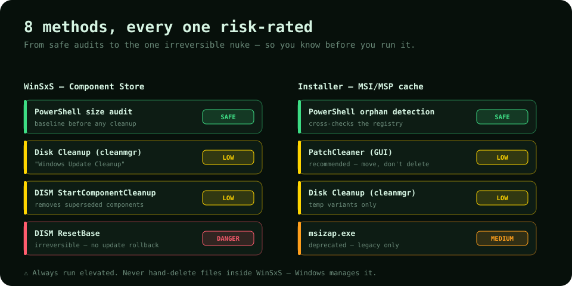

<p align="center">
  
</p>

<h1 align="center">💀 bloatkill</h1>

<p align="center"><b>Windows storage remediation reference — sysadmin-grade, terminal-aesthetic, zero dependencies.</b><br>The right cleanup commands, in the right order, with the right risk context.</p>

<p align="center">
  <a href="https://ry-ops.github.io/bloatkill"></a>
  
  
  
</p>

<p align="center"><b>Live → <a href="https://ry-ops.github.io/bloatkill">ry-ops.github.io/bloatkill</a></b></p>

---

## What it is

A static dashboard for auditing and cleaning the two biggest Windows storage offenders, without accidentally breaking your system's ability to repair or roll back updates:

| Folder | Path | Typical size |
|---|---|---|
| Component Store | `C:\Windows\WinSxS` | 8–15 GB |
| Installer cache | `C:\Windows\Installer` | 3–12 GB |

## The 8 methods, risk-rated

<p align="center">
  
</p>

Every method carries a risk badge and inline context, and copies to your clipboard in one click. The one you must think twice about is **`DISM ResetBase`** — it's irreversible and permanently disables update rollback.

## Use it

1. Open **[ry-ops.github.io/bloatkill](https://ry-ops.github.io/bloatkill)** (or `index.html` locally).
2. Pick the **WinSxS** or **Installer** tab.
3. Expand a method, read the risk, hit **COPY**.
4. Run it in an **elevated** PowerShell or CMD session.

**Always start with a safe audit:**

```powershell
# WinSxS size, before touching anything
Get-ChildItem C:\Windows\WinSxS | Measure-Object -Property Length -Sum |
  Select-Object @{N="Size(GB)";E={[math]::Round($_.Sum/1GB,2)}}

# The recommended safe WinSxS cleanup
Dism.exe /online /Cleanup-Image /StartComponentCleanup
```

> ⚠️ **Run as Administrator. Never manually delete files inside WinSxS — Windows manages it.**

## Deploy

One static `index.html`: no build, no framework, no dependencies. Hosted on GitHub Pages (**Deploy from branch → `main` → `/`**). To run locally, just open the file.

```
bloatkill/
├── index.html    # the whole app — HTML, CSS, JS in one file
└── docs/         # the diagrams above
```

## Related

- [git-steer](https://github.com/ry-ops/git-steer) — GitHub fleet health, run entirely on GitHub
- [ry-ops.dev](https://ry-ops.dev) — infrastructure automation notes

<p align="center"><sub><i>Part of the ry-ops infrastructure suite. Always test in non-prod.</i> 💀</sub></p>

<!-- org-footer -->
---

<p align="center"><sub>Part of <a href="https://github.com/ry-ops">ry-ops</a> · building the pipes between infrastructure, automation, and observability · built by <a href="https://github.com/ry-ops">ry-ops</a></sub></p>
