<p align="center"></p>

# 💀 bloatkill

> Windows storage remediation reference — sysadmin-grade, terminal-aesthetic, zero dependencies.

**Live → [ry-ops.github.io/bloatkill](https://ry-ops.github.io/bloatkill)**

---

## What is bloatkill?

**bloatkill** is a static reference dashboard for auditing and cleaning two of the most notorious Windows storage offenders:

| Folder | Path | Typical Size |
|--------|------|-------------|
| Component Store | `C:\Windows\WinSxS` | 8–15 GB |
| Installer Cache | `C:\Windows\Installer` | 3–12 GB |

It surfaces the right cleanup commands, in the right order, with the right risk context — so you don't accidentally nuke your system's ability to repair or roll back updates.

Part of the [ry-ops](https://ry-ops.dev) infrastructure automation suite, alongside [git-steer](https://github.com/ry-ops/git-steer).

---

## Features

- 🗂 **Two-tab interface** — WinSxS and Installer, each with full context
- 🔧 **8 cleanup methods** — from safe read-only audits to aggressive irreversible nukes
- 🏷 **Risk badges** — SAFE / LOW RISK / MEDIUM / DANGER on every method
- 📋 **One-click copy** — every command copies to clipboard instantly
- ⚠️ **Inline warnings** — risk context baked in so you know what you're running
- 📱 **Fully responsive** — works on mobile, tablet, and desktop
- ⚡ **Zero dependencies** — single `index.html`, no build step, no framework

---

## Cleanup Methods

### WinSxS — Component Store

| Method | Risk | Notes |
|--------|------|-------|
| PowerShell size audit | 🟢 SAFE | Baseline measurement before any cleanup |
| Disk Cleanup (`cleanmgr`) | 🟡 LOW | Select "Windows Update Cleanup" in the UI |
| DISM `StartComponentCleanup` | 🟡 LOW | Removes superseded components after 30-day window |
| DISM `ResetBase` | 🔴 DANGER | Irreversible — disables update rollback permanently |

### Installer — MSI/MSP Cache

| Method | Risk | Notes |
|--------|------|-------|
| PowerShell orphan detection | 🟢 SAFE | Cross-references registry — review before deleting |
| PatchCleaner (GUI) | 🟡 LOW | Recommended — move orphans to another drive first |
| Disk Cleanup (`cleanmgr`) | 🟡 LOW | Limited — clears temp variants only |
| `msizap.exe` | 🟠 MEDIUM | Deprecated — legacy systems only |

---

## Usage

### On the dashboard

1. Visit **[ry-ops.github.io/bloatkill](https://ry-ops.github.io/bloatkill)**
2. Select a folder tab — **WinSxS** or **Installer**
3. Click any method to expand it
4. Hit **COPY** to grab the command
5. Run in an **elevated PowerShell or CMD session**

### Direct commands

Always start with a safe audit before running any cleanup:

```powershell
# Audit WinSxS size first
Get-ChildItem C:\Windows\WinSxS | Measure-Object -Property Length -Sum |
  Select-Object @{N="Size(GB)";E={[math]::Round($_.Sum/1GB,2)}}

# Safe WinSxS cleanup (recommended starting point)
Dism.exe /online /Cleanup-Image /StartComponentCleanup

# Detect Installer orphans before touching anything
$valid = Get-ChildItem "HKLM:\SOFTWARE\Microsoft\Windows\CurrentVersion\Installer\UserData" -Recurse |
  Where-Object { $_.Property -contains "LocalPackage" } |
  ForEach-Object { (Get-ItemProperty $_.PSPath).LocalPackage }

Get-ChildItem "C:\Windows\Installer\*.ms?" |
  Where-Object { $_.FullName -notin $valid } |
  Select-Object FullName, @{N="MB";E={[math]::Round($_.Length/1MB,1)}}
```

> ⚠️ **Always run as Administrator. Never manually delete files inside WinSxS.**

---

## Deployment

This is a single static `index.html` — no build step, no Node, no Ruby, no dependencies.

Hosted on GitHub Pages via **Deploy from branch** → `main` → `/ (root)`.

To run locally just open `index.html` in any browser.

---

## Project Structure

```
bloatkill/
├── index.html    # entire app — HTML, CSS, JS in one file
└── README.md
```

---

## Related Projects

- [git-steer](https://github.com/ry-ops/git-steer) — GitHub autonomy engine & security posture dashboard
- [git-steer](https://github.com/ry-ops/git-steer) — Self-hosting GitHub autonomy engine
- [ry-ops.dev](https://ry-ops.dev) — Infrastructure automation blog

---

*Part of the ry-ops infrastructure automation suite. Always test in non-prod.* 💀

<!-- org-footer -->
---

<p align="center"><sub>Part of <a href="https://github.com/ry-ops">ry-ops</a> · building the pipes between infrastructure, automation, and observability · built by <a href="https://github.com/ry-ops">ry-ops</a></sub></p>
